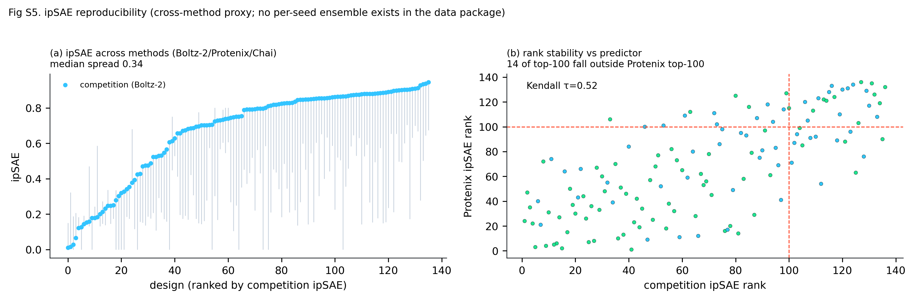
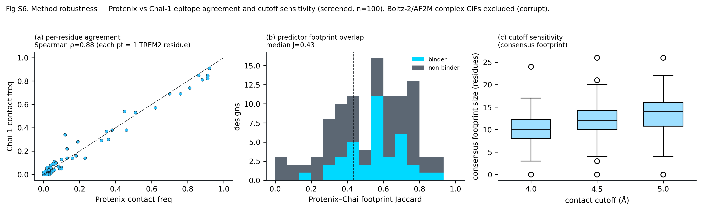
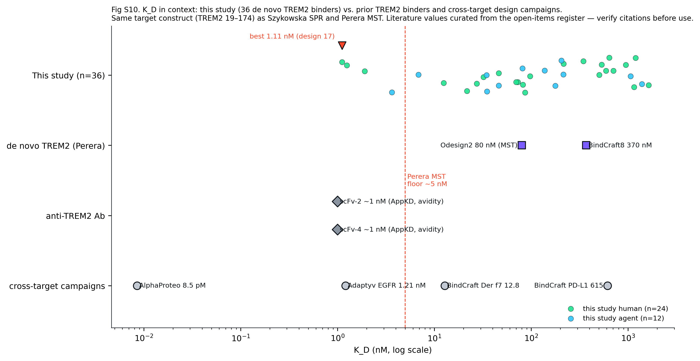
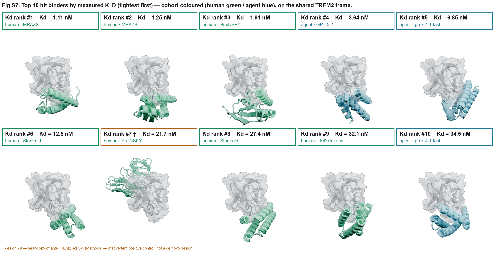

# Supplementary Information — Structure and Epitope Analysis

> **Illustrated version** — supplementary figures embedded inline; content is identical to [`supplementary_information.md`](supplementary_information.md).

*Companion to `drafts/structure_analysis.md`. This section owns **main-text Figures 8–12** and
**Supplementary Figures S4–S7** + **Supplementary Tables S7–S9**. Every supplementary item below is cited
in the section draft. Rendered figures live in `analyses/structure_epitope/figures/`; table data in
`analyses/structure_epitope/results/`.*

> **Renumbering note.** Five produced-but-uncited figures were dropped — former **Fig 11** (fold × cohort)
> and former **Figs S4** (structural clustering), **S7** (α-helical bias), **S8** (rules compliance), **S9**
> (rate scatters) — and the remainder compacted with no gaps. **All figure files, `savefig` calls, and
> in-figure titles now use the final numbering** (table below); the dropped figures' `savefig` calls are
> neutralized in their (shared) generating scripts.

---

## Main-text figures (this section) — cross-reference

| Fig | Title | Rendered file | Cited in draft |
|---|---|---|---|
| **8a–d** | TREM2 binding partners in a common orientation (our binder + scFv-2/-4 + phosphatidylserine; crystal superposition onto the design frame) | `figures/blender/sample_renders/fig08_partners.png` | §1 ✓ |
| **8e** | Epitope landscape of the TREM2 IgSF domain (per-residue binder contact frequency; apical convergence) | `fig08e_epitope_landscape.png` | §1 ✓ |
| **9** | Interface size — not epitope or chemistry — separates binders from non-binders (P_expressed, n=89) | `fig09_interface_features.png` | Methods ✓ |
| **10** | Complex gallery (3D): leaderboard (a), best-design interface + EvoEF2 hotspots (b), 37 hit binders superposed (c) | `figures/blender/sample_renders/fig10_gallery.png` | §1 ✓ |
| **11** | Structural interface size & length track affinity; confidence scores do not (P_kd, n=36) | `fig11_metrics_vs_affinity.png` | Methods ✓ |
| **12** | Kinetic decomposition of binding: K_D = k_off / k_on (rate-eligible designs) | `fig12_kinetic_decomposition.png` | §3 ✓ (Fig 12a) |

---

## Supplementary figures

### Fig S4. ipSAE reproducibility
Cross-method proxy for seed reproducibility (no per-seed ensemble exists in the data package). **(a)** ipSAE
across Boltz-2/Protenix/Chai — median cross-method spread 0.34; **(b)** rank stability — 14 of the
competition's top-100 (ranked by Boltz-2 ipSAE) fall outside a Protenix-ipSAE top-100 (Kendall τ=0.52), so
the selection is ~14 % method-dependent.
*Rendered:* `figS4_ipsae_reproducibility.png` · *Source:* `jobs/supp_figures2.py`. **Cited in §3.**

### Fig S5. Method robustness — Protenix vs Chai-1 epitope agreement and cutoff sensitivity (screened, n=100)
**(a)** per-residue contact-frequency agreement (Spearman ρ=0.88); **(b)** predictor footprint overlap
(median Jaccard 0.435); **(c)** consensus-footprint cutoff sensitivity (4.0 / 4.5 / 5.0 Å → 10 / 12 / 14
residues).
*Rendered:* `figS5_method_robustness.png` · *Source:* `jobs/supp_figures.py`. **Cited in Methods** (panels S5, S5a, S5c).

### Fig S6. Literature K_D comparison
Our best measured affinity **1.11 nM** (design 17, SPR-kinetic) vs the best prior de novo TREM2 binder
(Perera "Odesign2", 80 nM by MST, ≈5 nM detection floor) and the anti-TREM2 scFvs (Szykowska, ≈1 nM by SPR
with avidity), on the matched TREM2 19–174 construct.
*Rendered:* `figS6_literature_kd.png` · *Source:* EXTRA-2 literature-K_D analysis
(`results/literature_kd_comparison.csv`). **Cited in §3.**

### Fig S7. Tightest binders by measured K_D — top 10 (3D gallery)
The ten hit binders with the lowest measured K_D (tightest first, 1.11–34.5 nM), each on the shared TREM2
frame in the Fig 10 gallery style, cohort-coloured (human green / agent blue). This complements the
ipSAE-ordered **Fig 10a**: K_D order and ipSAE order differ sharply — the tightest binder (design 17,
1.11 nM) sits at ipSAE leaderboard rank 24, and design 74 (1.91 nM) at rank 78. **Design 79 (rank #7,
21.66 nM) is flagged** (amber box, †): it is a near-copy of anti-TREM2 scFv-4 (Methods rules-compliance
note) — an inadvertent positive control, not a de novo design (§3).
*Rendered:* `figures/blender/sample_renders/figS7_kd_gallery_top10.png` · *Source:*
`figures/blender/render_gallery.py` (tiles) + `figures/blender/compose_fig10_kd.py` (grid). **Cited in §3.**

---

## Supplementary tables

### Table S7. Cross-predictor interface panel
Interface descriptors (BSA, interface-residue counts, H-bonds, salt bridges, composition and
secondary-structure fractions) computed on **Protenix** (primary, 141), **Chai-1** (141), and the
team-contributed **ESMFold2** panel (100 screened), with per-descriptor binder-vs-non-binder discrimination
and inter-predictor agreement / signed differences anchored to Protenix.
*Full table:* `results/predictor_panel.md`. **Cited in Methods** (Tables S7–S9).

### Table S8. Per-predictor metric table — AUROC, ρ, FDR
For every metric named in the Summary: binder-vs-non-binder **AUROC** (P_expressed, n=89), affinity
**Spearman ρ** (P_kd, n=36), and **BH-FDR q** per tier, across Protenix / Chai / ESMFold2 / Boltz-2 / AF2M
(ESM-2 / SaProt are sequence-based, one value). `*` = q<0.10; `—` = metric undefined for that predictor.
*Full table:* `results/metric_predictor_table.md`. **Cited in §3** (and Methods).

*Headline rows — binder-vs-non-binder discrimination, AUROC (q<0.10 = \*):*

| metric | Boltz-2 | Protenix | Chai | ESMFold2 | AF2M | sequence |
|---|---|---|---|---|---|---|
| buried area (BSA) | 0.65* | **0.72*** | 0.68* | 0.69* | 0.70* | — |
| binder interface residues | 0.62 | 0.69* | 0.68* | 0.67* | 0.64 | — |
| PRODIGY ΔG | 0.58 | 0.53 | 0.53 | — | 0.55 | — |
| ipTM | 0.60 | 0.79* | 0.77* | — | 0.65* | — |
| pLDDT (mean) | 0.63* | 0.71* | 0.74* | — | 0.64* | — |
| ipSAE | 0.65* | 0.78* | 0.78* | — | 0.66* | — |
| ESM-2 pll | — | — | — | — | — | 0.52 |
| SaProt pll | — | — | — | — | — | 0.55 |

*Headline rows — affinity correlation, Spearman ρ (q<0.10 = \*):*

| metric | Boltz-2 | Protenix | Chai | ESMFold2 | AF2M |
|---|---|---|---|---|---|
| buried area (BSA) | +0.20 | **+0.50*** | +0.43* | −0.00 | +0.35 |
| binder interface residues | +0.32 | +0.47* | +0.52* | +0.04 | +0.45* |
| PRODIGY ΔG | −0.28 | +0.52* | +0.42* | — | −0.10 |

*(Two patterns: discrimination reproduces across all five predictors while the affinity correlation is
significant only in Protenix and Chai; and the competition's own Boltz-2 confidence is the weakest binder
classifier. Full ragged table — including the ipSAE affinity row, ρ=0.40 — in the source file.)*

### Table S9. Signed cross-predictor differences (vs Protenix)
Each descriptor's value on Chai / ESMFold2 / Boltz-2 / AF2M relative to Protenix: median signed Δ, relative
%, fraction Protenix-greater, and Wilcoxon p. E.g. AF2M's interface sizes track Protenix most closely
(median BSA Δ −14 Ų, n.s.) while Chai and ESMFold2 bury 245–418 Ų more.
*Full table:* `results/metric_predictor_signed_diff.csv` (rendered in `results/metric_predictor_table.md`).
**Cited in §3** (and Methods).

---

## Alignment status (draft ↔ SI ↔ citations)

- **draft ↔ SI: fully aligned.** Every supplementary item (Fig S4–S7, Tables S7–S9) is cited in the draft,
  and every draft supplementary reference resolves — **no dangling references and no orphans**.
- **Dropped (produced but uncited):** former Fig 11 (fold × cohort) and Figs S4/S7/S8/S9. PNG outputs
  removed; the generation code is retained (shared scripts also make the kept figures) with the dropped
  figures' `savefig` calls neutralized.
- **3D figures wired in.** **Fig 8a–d** (crystal partners, `fig08_partners.png`) and **Fig 10** (complex
  gallery, `fig10_gallery.png`) are now cited in §1. To seat the four partner panels at 8a–d, the 2D
  per-residue landscape moved from panel 8d to **8e** (file `fig08e_epitope_landscape.png`).
- **draft ↔ citations: aligned.** All six author-year citations resolve in `references/*.bib`
  (Bennett2023, Cotet2025, Kober2016, Perera2026, Sudom2018, Szykowska2021). **Perera2026 is now the
  verified bioRxiv 2026 entry** (Perera et al., "XL-MS and De Novo Protein Design Identified a Common Motif
  for TREM2 Binding"; DOI 10.64898/2026.04.23.720433) — no longer a placeholder.
